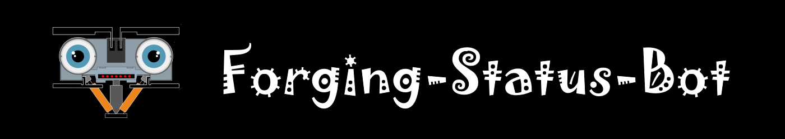

Send a 'forger-status' message every time a new block is forged by a delegate.

## Join Bot Discord server.

Go to [https://discord.gg/RDstbDTKaH](https://discord.gg/RDstbDTKaH) to join the bot Discord server.

## Configure lisk-core log level.

This code REQUIRE that lisk-core node run with `info` log level. Validate your lisk-core log level configuration. It should look like this:

```json
  "logger": {
    "fileLogLevel": "info",
    "consoleLogLevel": "info"
  }
```

If you edited the configuration, don't forget to restart lisk-core for the new log level to apply.


## Install tool on Lisk-Core 3 forging server

**DO NOT MODIFY INSTALLATION PATH!** 

`$HOME/forging-status-bot/` is hardcoded in the scripts for simplicity.

#### Clone project
```bash
cd "$HOME"
git clone "https://github.com/Gr33nDrag0n69/forging-status-bot.git"
```

#### Make all bash scripts executable
```bash
chmod 0700 $HOME/forging-status-bot/*.sh
```

#### Test lisk-core binary path & log file path
```bash
$HOME/forging-status-bot/test-configuration.sh
```

#### Start Log Monitor
```bash
$HOME/forging-status-bot/start-logmonitor.sh
```

#### Install Keep Alive
```bash
$HOME/forging-status-bot/install-keepalive.sh
```

## Script List

| Bash Script            | Description                                                                                                                                         |
| ---------------------- | --------------------------------------------------------------------------------------------------------------------------------------------------- |
| test-configuration.sh  | Validate default values of lisk-core binary path & log file path.                                                                                   |
| send-message.sh        | Send forging status message to Discord server.                                                                                                      |
| show-log.sh            | Show the content of `forging-status-bot/logs/logmonitor`.log`.                                                                                      |
| logmonitor.sh          | Monitor `$HOME/.lisk/lisk-core/logs/lisk.log` for `Forged new block`.<br />When a new block is forged, execute `forging-status-bot/send-message.sh` |
| start-logmonitor.sh    | Start `forging-status-bot/logmonitor.sh` as a background process.                                                                                   |
| stop-logmonitor.sh     | Kill all running instance of `forging-status-bot/logmonitor.sh` background process.                                                                 |
| keepalive.sh           | If `forging-status-bot/logmonitor.sh` background process isn't currently running,<br />execute `forging-status-bot/start-logmonitor.sh`.            |
| install-keepalive.sh   | Add crontab job to execute `keepalive.sh` once each minute.                                                                                         |
| uninstall-keepalive.sh | Remove crontab job.                                                                                                                                 |


## Clean Uninstall

Use these steps to remove the tool from your server.

#### Clean Crontab
> $HOME/forging-status-bot/uninstall-keepalive.sh

#### Stop Log Monitor
> $HOME/forging-status-bot/stop-logmonitor.sh

#### Delete Directory
> rm -rf "$HOME/forging-status-bot/"
